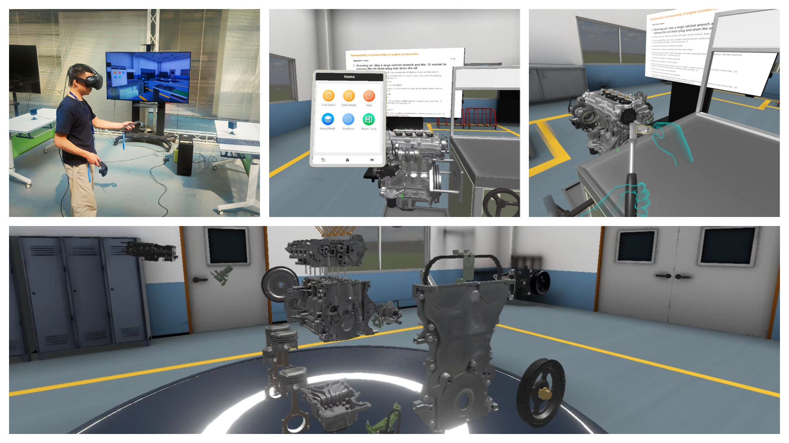

A Virtual Reality Training System for Automotive Engines Assembly and Disassembly
===============

## Introduction
SUSTech_VREngine is an open-source software of training students to learn automotive engine assembly and disassembly, which aims to allow students to use VR headsets, handles and other accessories to simulate the disassembly and assembly of automotive engines in a virtual environment. SUSTech_VREngine is developed based on Unity3D and VRTK plugins and has been implemented and demonstrated in the courses of Chinese colleges to train students of automotive-related majors for automotive engine assembly and disassembly. 

The source code and the executable file (Microsoft Windows) are available at https://github.com/LadissonLai/SUSTech_VREngine for facilitating the development of VR systems in the automotive industry. Finally, a video of the operation in SUSTech_VREngine is available at https://www.youtube.com/watch?v=yZe4YTwwAC4.

## Recommended system
* Intel i7 gen 7th or better
* +16 GB RAM memory or larger memory
* NVIDIA GTX 1080 or better
* Windows 10

## Development environment
* Unity 2019.3.12f1
* VRTK
* HTC VIVE

## Getting Started
* Install [SteamVR](https://store.steampowered.com/app/250820/SteamVR/).
* Connect the HTC VIVE device and launch it.
* Install the realeased package. The package is a compressed file named SUSTech_VREngine.zip on the github released page. Download and extract the released file.
* Launch the SUSTech_VREngine.exe file, and it will automatically start SteamVR software and connect the HTC VIVE device.
* Enjoy!!
  
## Teaching Contents
* Training students in the use of toolbox.
* Training students in the disassembly and assembly of automotive engines.
* Examing students in the disassembly and assembly of automotive engines.
